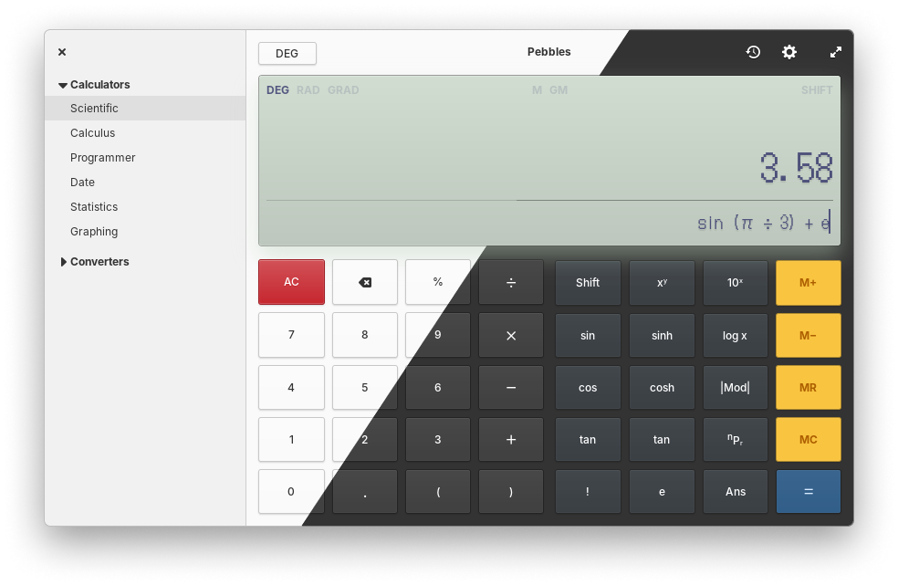

<div>
    <h1 align="center">Pebbles</h1>
    <h3 align="center">An easy to use yet powerful calculator app</h3>
</div>



<br>
Pebbles is an advanced calculator application based in Vala and Gtk.


## Get it from store
| elementary OS    | FlatHub       	|
|------------------|---------------	|
|[](https://appcenter.elementary.io/com.github.subhadeepjasu.pebbles)|<a href="https://flathub.org/apps/details/com.github.subhadeepjasu.pebbles"></a>|

## Install from source using meson
You can install Pebbles by compiling it from source, here's a list of required dependencies:
 - `elementary-sdk`
 - `gtk+-3.0>=3.18`
 - `granite>=5.3.0`
 - `gsl>=2.4`
 - `glib-2.0`
 - `libsoup-2.4`
 - `gobject-2.0`
 - `libhandy-1`
 - `meson`

<i>For non-elementary distros, (such as Arch, Debian, etc) you are required to install "vala" as additional dependency.</i>

Clone repository and change directory
```
git clone https://github.com/SubhadeepJasu/pebbles.git
cd pebbles
```

Compile, install and start Pebbles on your system
```
meson _build --prefix=/usr
ninja -C _build install
com.github.subhadeepjasu.pebbles
```
To run pebbles in testing mode
```
com.github.subhadeepjasu.pebbles --test
```

## Install from source using flatpak
```
flatpak-builder build  com.github.subhadeepjasu.pebbles.yml --user --install --force-clean
flatpak run com.github.subhadeepjasu.pebbles
```
To run pebbles in testing mode
```
flatpak run com.github.subhadeepjasu.pebbles --test
```


## Discussions
If you want to ask any questions or provide feedback, you can make issues in this repository

## Contributing
Feel free to send pull requests to this repository with your code.


<br>
<sup><b>License</b>: GNU GPLv3</sup>
<br>
<sup>© Copyright 2017-2022 Subhadeep Jasu</sup>
